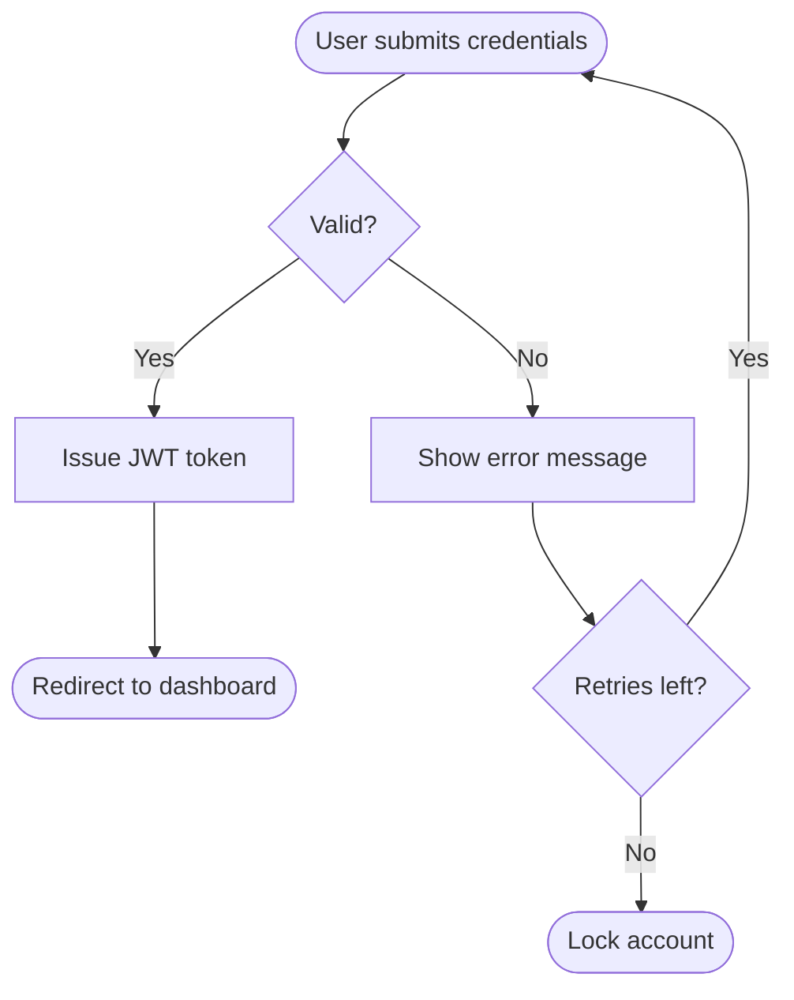

# Mermaid Diagram Builder

## Overview
Mermaid is a text-based diagramming language that renders to SVG. Because diagrams are plain text, they live in version control, diff cleanly in PRs, and render natively on GitHub, GitLab, Notion, Obsidian, VS Code, and most Markdown tools.

This skill helps you (1) pick the correct diagram type for the user's intent, (2) write valid, idiomatic Mermaid, (3) style it for clarity, and (4) verify it renders before delivering.

Keywords: mermaid, diagram, flowchart, sequence diagram, ER diagram, entity relationship, class diagram, state diagram, gantt, C4, architecture, diagram as code, graphviz alternative, markdown diagram.

## Workflow
1. **Clarify intent.** Determine what the user is modeling: a *process/decision* (flowchart), an *interaction over time* (sequence), a *data model* (ER), an *object structure* (class), *lifecycle states* (state), a *schedule* (gantt), or a *system's components* (C4/architecture). If ambiguous, ask one targeted question or pick the best fit and say why. See `references/diagram-types.md` for the selection guide.
2. **Choose the diagram type** using the decision table in `references/diagram-types.md`.
3. **Draft the Mermaid code** following the syntax patterns in `references/syntax-cheatsheet.md`. Start with the header keyword (e.g. `flowchart TD`), then nodes/relationships, then styling last.
4. **Apply clarity conventions** (direction, concise labels, grouping with subgraphs, consistent node shapes). See Best Practices below.
5. **Validate** the syntax. Run `scripts/validate_mermaid.py <file.mmd>` for static checks, or use the Mermaid CLI (`mmdc`) if available to do a real render. See `scripts/validate_mermaid.py`.
6. **Deliver** the diagram inside a fenced ```mermaid code block so it renders in Markdown. Offer a PNG/SVG export command if the user needs an image.

## Choosing a diagram type (quick reference)
| User intent / phrase | Diagram type | Header keyword |
|---|---|---|
| "steps", "process", "decision", "if/else", "workflow" | Flowchart | `flowchart TD` |
| "API call", "request/response", "who talks to whom over time" | Sequence | `sequenceDiagram` |
| "database", "tables", "schema", "relationships", "foreign keys" | Entity Relationship | `erDiagram` |
| "classes", "objects", "OOP", "inheritance", "methods/attributes" | Class | `classDiagram` |
| "states", "lifecycle", "status transitions", "state machine" | State | `stateDiagram-v2` |
| "timeline", "schedule", "project plan", "milestones" | Gantt | `gantt` |
| "system architecture", "services", "containers", "boundaries" | C4 / Architecture | `C4Context` / `architecture-beta` |
| "user journey", "experience steps with sentiment" | Journey | `journey` |
| "git branches", "commits", "merges" | Git graph | `gitGraph` |

Full guidance, including when NOT to use a given type, is in `references/diagram-types.md`.

## Worked example (flowchart)
Input: "Diagram our login flow: user submits credentials, we check them, on success issue a token, on failure show an error and let them retry."

````markdown

````

More examples for every diagram type are in `examples/gallery.md`.

## Best Practices
- **Pick direction deliberately.** `TD`/`TB` (top-down) for processes and hierarchies; `LR` (left-right) for pipelines and wide flows that read like a timeline.
- **Keep labels short.** Put detail in the surrounding prose, not inside nodes. Long labels break layout.
- **Use shape semantics consistently.** `([rounded])` for start/end, `[rectangle]` for actions, `{diamond}` for decisions, `[(database)]` for stores, `[[subroutine]]` for sub-processes.
- **Group with `subgraph`** to show boundaries (services, teams, layers). Give subgraphs titles.
- **Quote tricky labels.** Wrap labels containing spaces-plus-special-characters, parentheses, or reserved words in double quotes: `A["Save (draft)"]`. Use `#quot;` / HTML entities or `<br/>` for line breaks.
- **Style last, sparingly.** Add `classDef` + `class` or `style` at the end. Avoid hardcoding colors that fight light/dark themes; prefer a small palette and semantic classes.
- **One concept per diagram.** If a flowchart exceeds ~25 nodes, split it or switch to subgraphs. Big diagrams are unreadable.
- **Always validate before delivering.** A diagram that doesn't render is worse than none.

## Common Pitfalls
- **Reserved word `end`** as a node id breaks flowcharts — capitalize it (`End`) or quote it.
- **Unescaped special characters** (`()`, `:`, `#`, `<`, `>`, `{}` ) inside labels — wrap the label in `"..."`.
- **Mixing diagram syntaxes** — sequence arrows (`->>`) don't work in flowcharts; flowchart arrows (`-->`) don't work in sequence diagrams.
- **Wrong header** — forgetting `flowchart`/`sequenceDiagram`/etc. on line 1 means nothing renders.
- **Edge labels in sequence vs flow** — flowchart uses `A -- text --> B`; sequence uses `A->>B: text`.
- **`stateDiagram` vs `stateDiagram-v2`** — always prefer `-v2`; it has better layout and features.
- **Indentation in `gantt`/`journey`** — these are whitespace-sensitive; keep sections and tasks aligned.

## Rendering & export
- In Markdown/GitHub: deliver inside a ```mermaid fence.
- To an image with the CLI: `npx -p @mermaid-js/mermaid-cli mmdc -i diagram.mmd -o diagram.svg` (or `-o diagram.png`).
- For theming/config, see the `%%{init: ...}%%` directive documented in `references/syntax-cheatsheet.md`.

## Files in this skill
- `references/diagram-types.md` — full type-selection guide with strengths, limits, and "use when / avoid when".
- `references/syntax-cheatsheet.md` — dense, copy-paste syntax for every major diagram type, plus styling and config directives.
- `examples/gallery.md` — a complete, renderable example for each diagram type with the prompt that produced it.
- `scripts/validate_mermaid.py` — stdlib Python static validator; checks headers, balanced brackets, reserved-word ids, and common syntax mistakes, and shells out to `mmdc` for a real render if installed.
