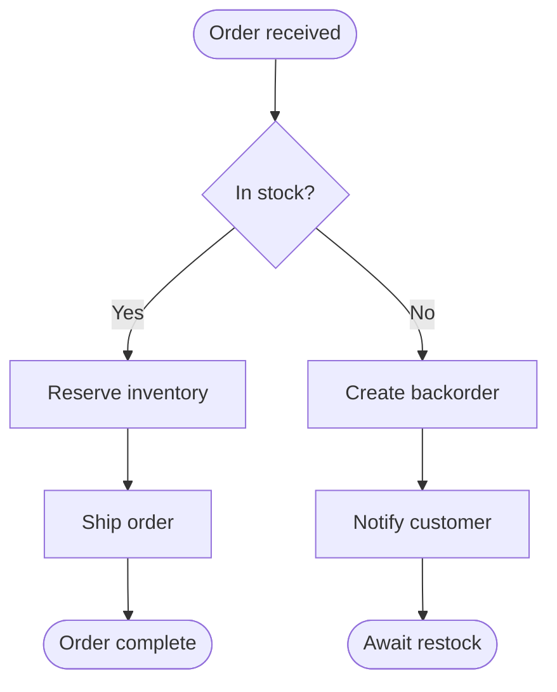
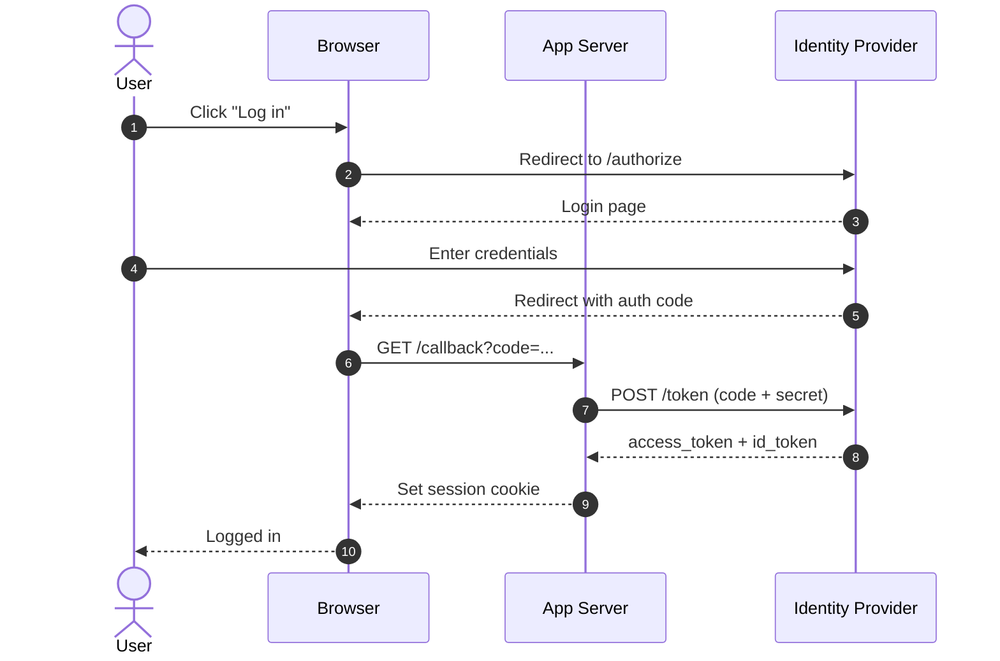
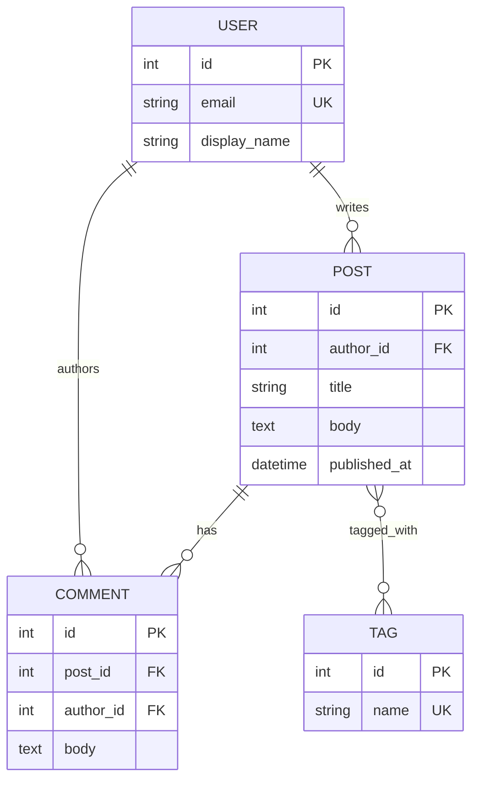
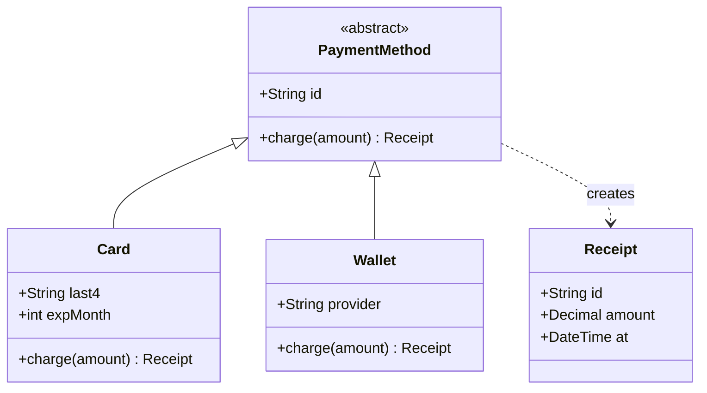
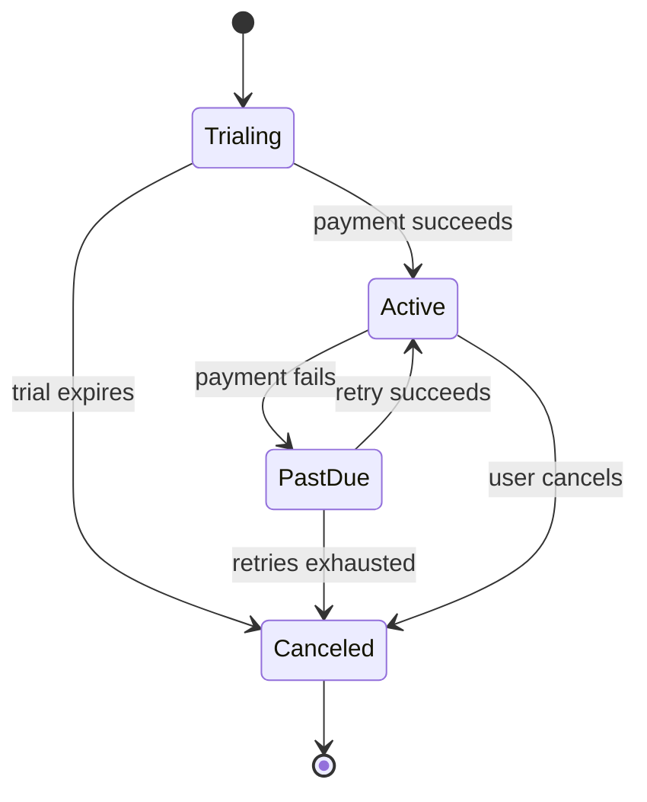
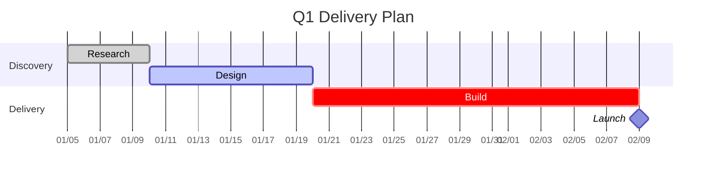
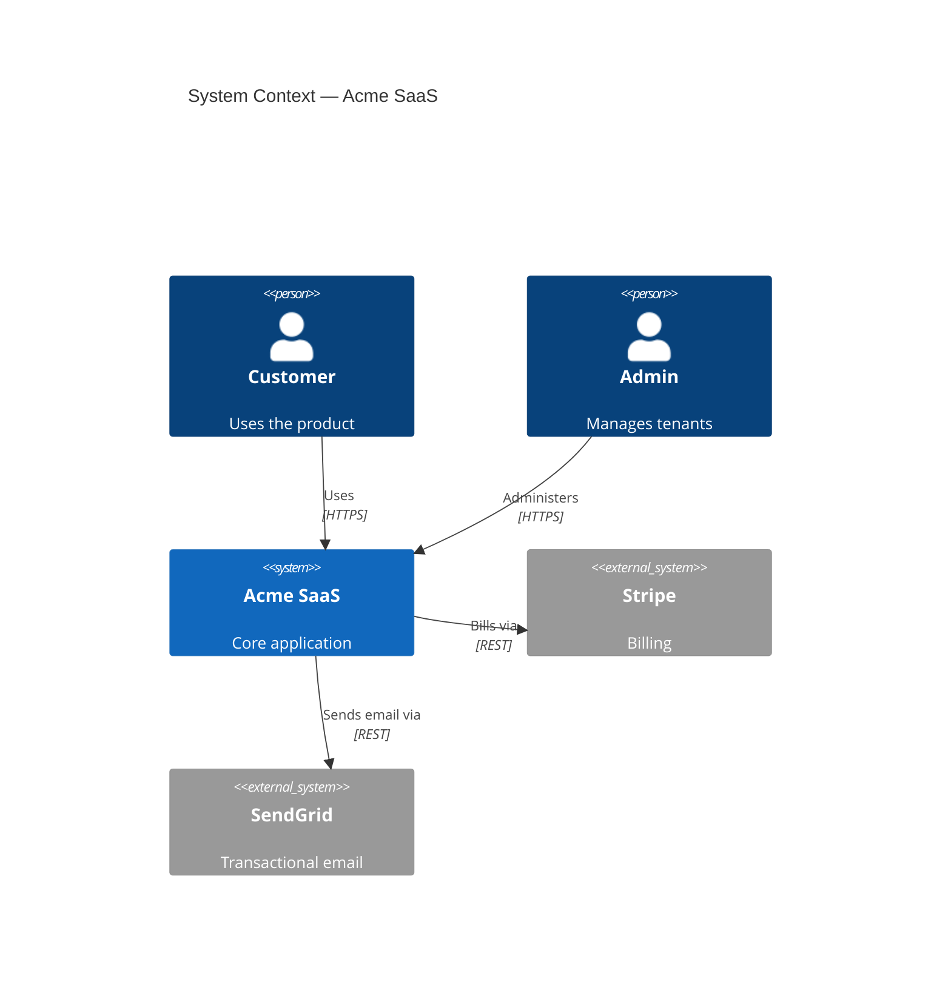
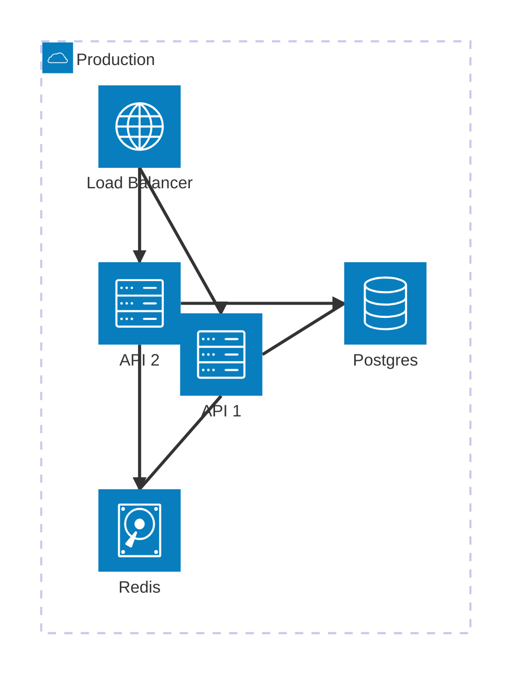
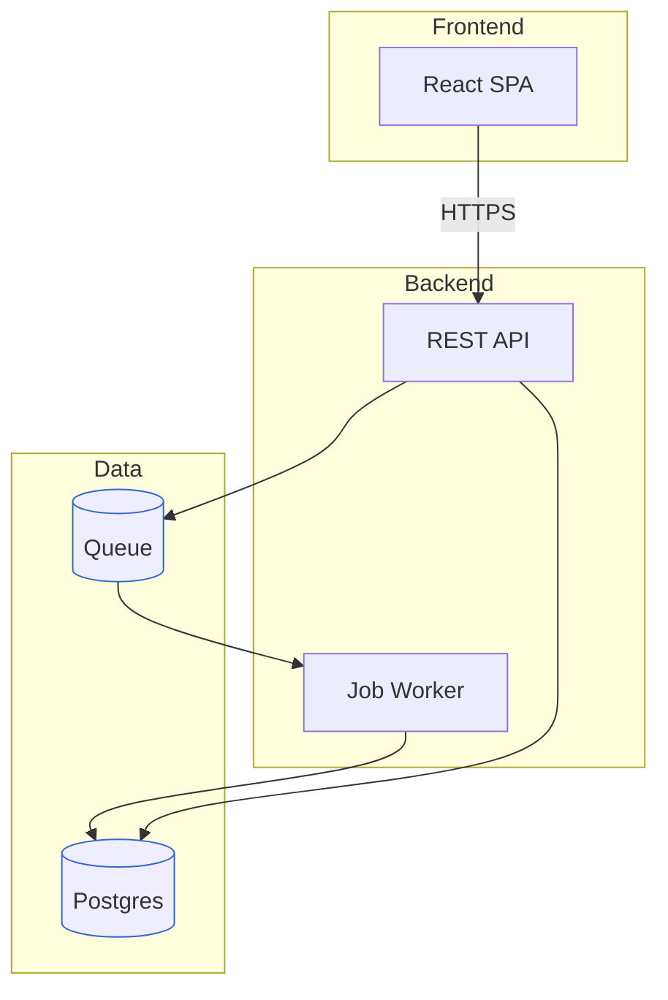

# Mermaid Example Gallery

Each example shows the **prompt** and the resulting renderable Mermaid. Copy any block into a ```mermaid fence.

---

## 1. Flowchart — Order fulfillment
**Prompt:** "Diagram order processing: receive order, check stock; if in stock ship it, otherwise backorder and notify the customer."


---

## 2. Sequence — OAuth login
**Prompt:** "Show the OAuth authorization-code flow between a browser, our app, and the identity provider."


---

## 3. ER — Blog schema
**Prompt:** "Model a blog: users write posts, posts have many comments, posts have tags (many-to-many)."


---

## 4. Class — Payment domain
**Prompt:** "Class diagram for a payment system with an abstract PaymentMethod and Card/Wallet subclasses."


---

## 5. State — Subscription lifecycle
**Prompt:** "State machine for a subscription: trialing, active, past_due, canceled."


---

## 6. Gantt — Quarter plan
**Prompt:** "Gantt for Q1: research 1 week, design 2 weeks, build 4 weeks, launch milestone."


---

## 7. C4 Context — SaaS
**Prompt:** "C4 context diagram: customers and admins use our SaaS, which integrates Stripe and SendGrid."


---

## 8. Architecture-beta — Web stack
**Prompt:** "Cloud architecture: load balancer to two API servers, shared Postgres and Redis."


---

## 9. Styled flowchart (architecture fallback) — Layered system
**Prompt:** "Show our layered architecture with frontend, backend, and data layers as boundaries."

