# Mermaid Syntax Cheatsheet

Dense, copy-paste-ready syntax. Header keyword must be the first non-comment line. Comments use `%% ...`.

## Flowchart
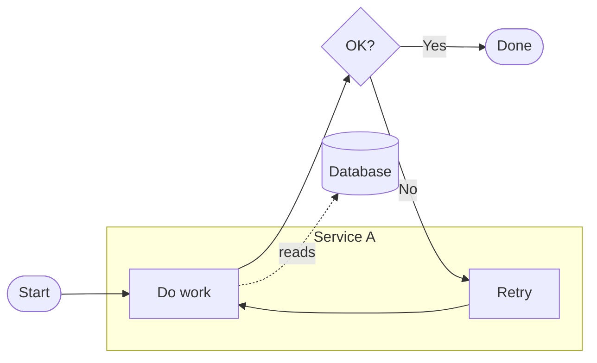
Edges: `-->` arrow, `---` line, `-.->` dotted, `==>` thick, `--text-->` labeled, `--o` circle end, `--x` cross end. Multiple targets: `A --> B & C`. Chain: `A --> B --> C`.
Node shapes: `[rect]`, `(rounded)`, `([stadium])`, `[[subroutine]]`, `[(cylinder)]`, `((circle))`, `>asymmetric]`, `{rhombus}`, `{{hexagon}}`, `[/parallelogram/]`, `[\\trapezoid\\]`.
Quote labels with specials: `A["Save (draft) #amp; exit"]`. Line break: `A["Line1<br/>Line2"]`.

## Sequence
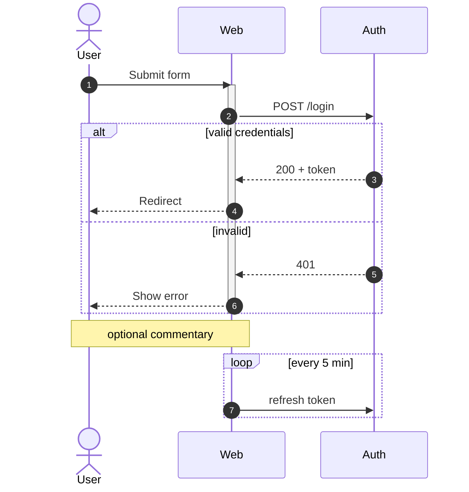
Arrows: `->` line, `-->` dotted line, `->>` solid arrowhead (sync), `-->>` dotted arrowhead (response), `-x` lost, `-)` async open arrow. Blocks: `alt/else`, `opt`, `loop`, `par/and`, `critical/option`, `break`, `rect rgb(...)` for background.

## Entity Relationship
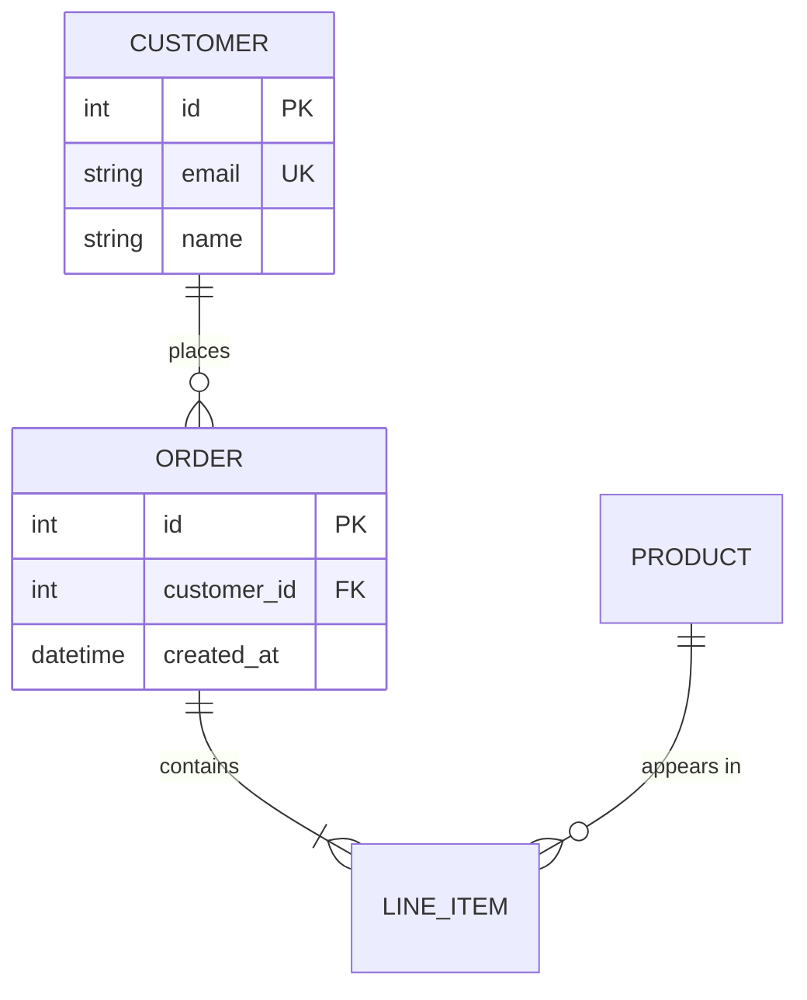
Cardinality (left--right): `|o` zero-or-one, `||` exactly-one, `}o` zero-or-many, `}|` one-or-many. `--` identifying (solid), `..` non-identifying (dashed). Keys: `PK`, `FK`, `UK`.

## Class
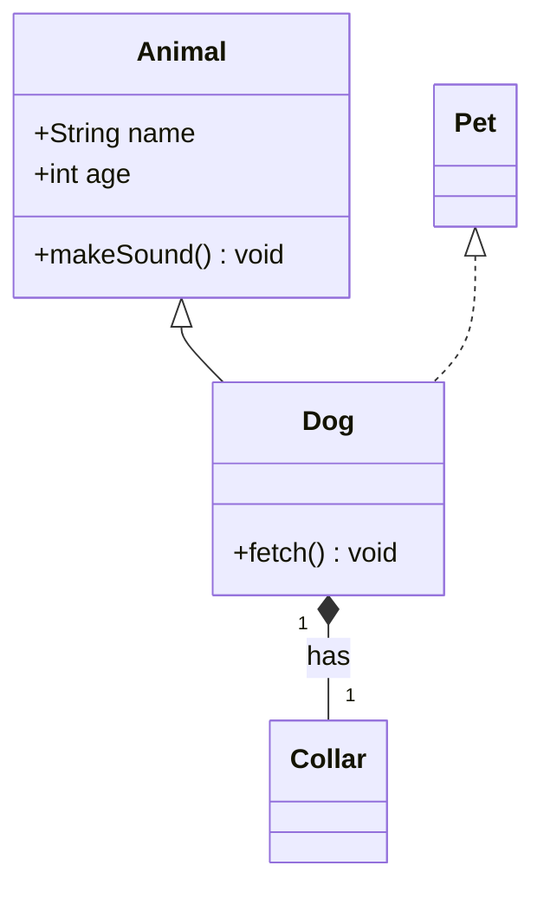
Arrows: `<|--` inherit, `*--` composition, `o--` aggregation, `-->` association, `..>` dependency, `..|>` realize. Visibility: `+ - # ~`. Generics: `List~int~`. Annotations: `<<interface>>`, `<<abstract>>`, `<<enumeration>>`.

## State
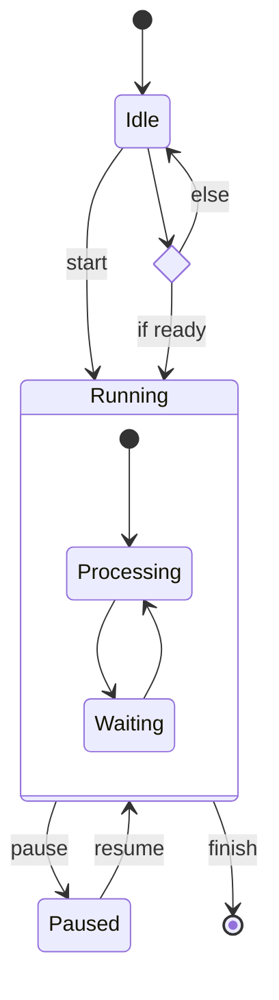
Special: `[*]` start/end, `<<choice>>`, `<<fork>>`, `<<join>>`, `--` separates parallel regions, `note right of X: ...`.

## Gantt
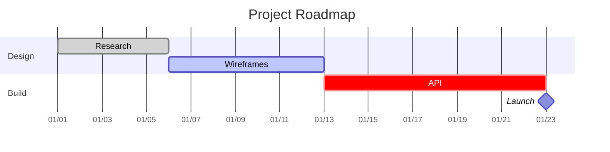
States: `done`, `active`, `crit`. `:milestone,` for points. Dependencies via `after <id>`.

## C4 Context
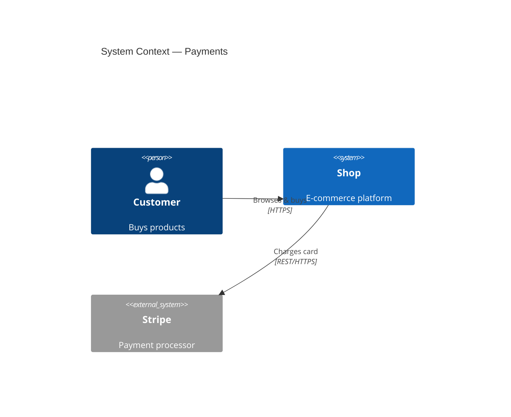

## Architecture-beta
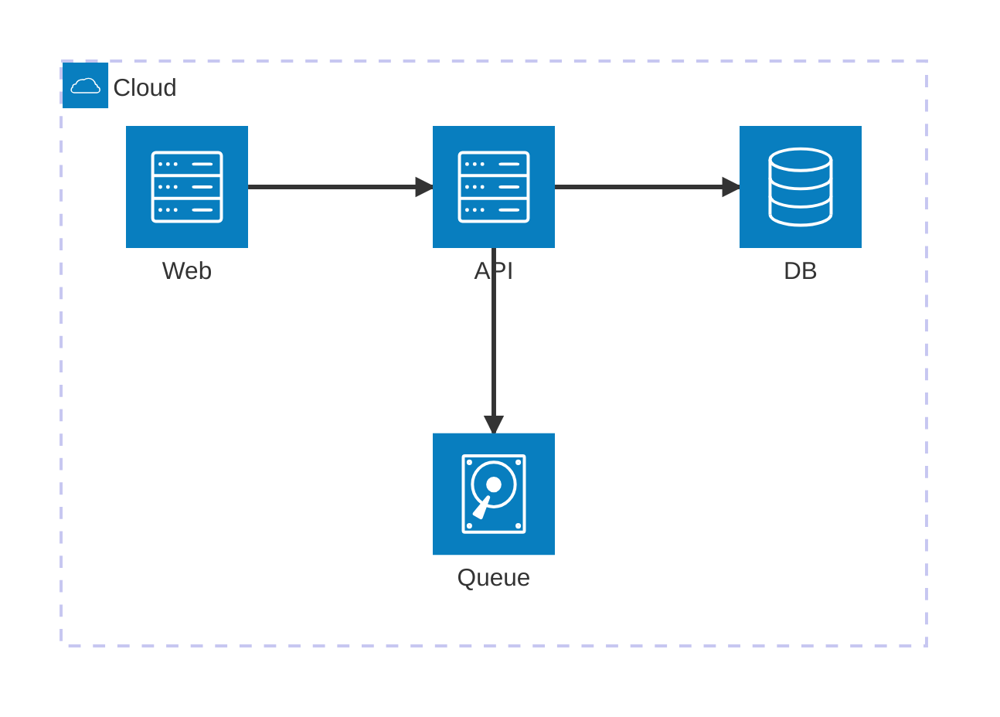

## User Journey
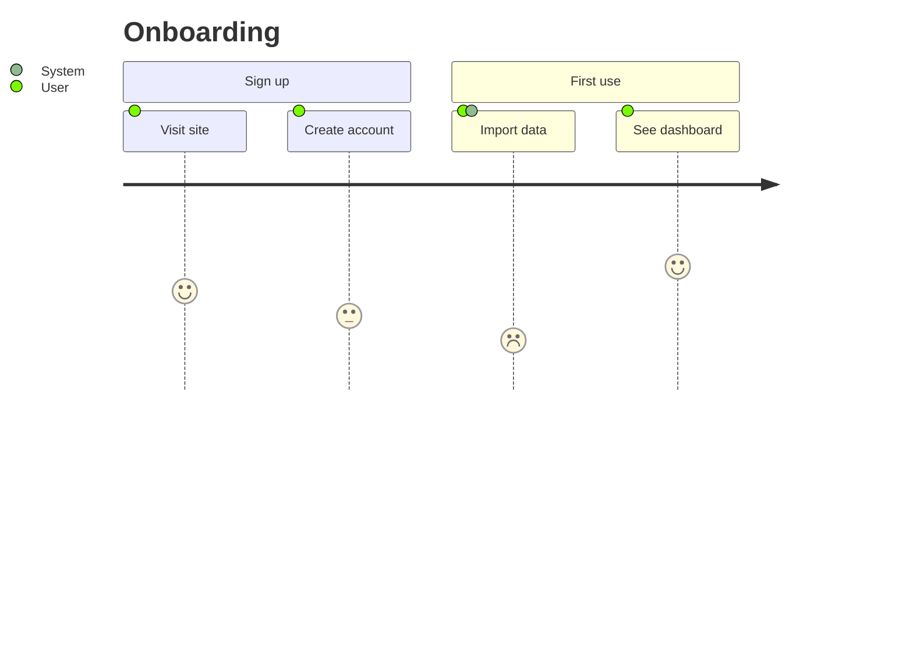

## Git Graph
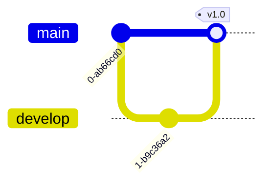

## Config & theming directive
Put at the very top to control theme/layout:
```
%%{init: {'theme':'neutral', 'flowchart':{'curve':'basis'}}}%%
flowchart TD
    A --> B
```
Themes: `default`, `neutral`, `dark`, `forest`, `base`. With `base` you can set `themeVariables`.

## Styling nodes
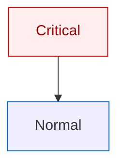
Links can be styled with `linkStyle 0 stroke:#f66,stroke-width:2px;` (index = order of definition).
