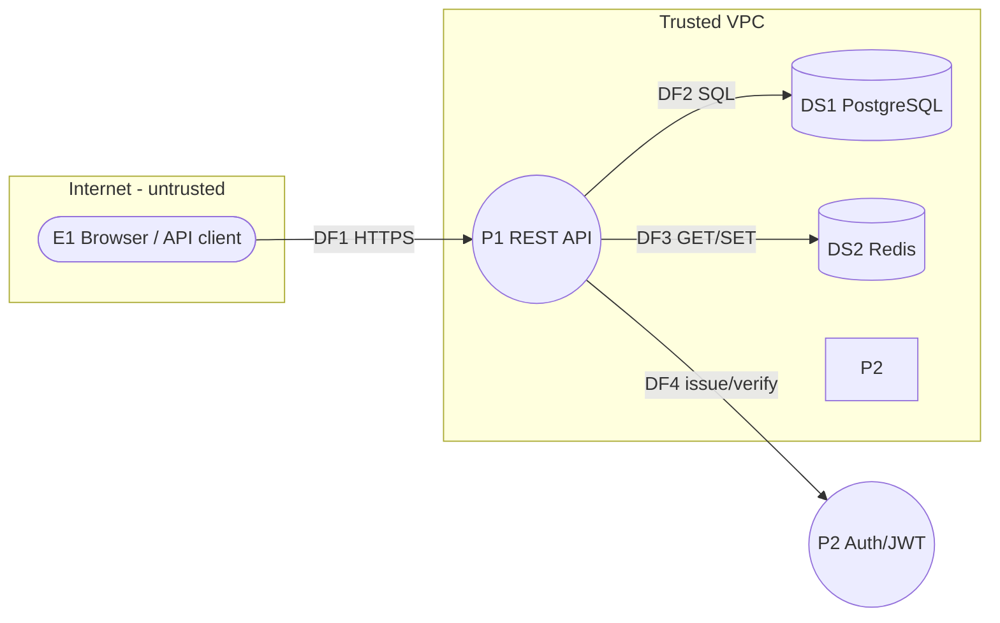

# Worked Example: Threat Model of a URL Shortener

A full STRIDE pass on a small but realistic system, showing input -> DFD -> threats -> prioritized mitigations.

## Input (system description)

A public URL-shortener web app:
- Users sign up / log in to manage their links (authenticated dashboard).
- Anyone can create a short link via a public form (anonymous allowed) or API.
- Visiting `https://sho.rt/<code>` redirects to the original long URL (302).
- A click-analytics counter increments per visit.
- Stack: React SPA -> REST API (Node) -> PostgreSQL; Redis cache for redirects; deployed behind a load balancer; auth via JWT.

**Assets:** user accounts/credentials, the integrity of redirect targets (a hijacked target enables phishing/malware), link analytics, service availability.

## Step 1-2: Data flow diagram



| ID | Type | Name | Trust |
|---|---|---|---|
| E1 | External entity | Browser / API client | Untrusted |
| P1 | Process | REST API | Trusted |
| P2 | Process | Auth (JWT issue/verify) | Trusted |
| DS1 | Data store | PostgreSQL (users, links) | Trusted |
| DS2 | Data store | Redis (redirect cache) | Trusted |
| DF1 | Data flow | HTTPS requests | Crosses TB1 (Internet edge) |
| DF2 | Data flow | SQL | Internal |
| DF3 | Data flow | Redis protocol | Internal |

Trust boundaries: **TB1** Internet edge (E1<->P1); **TB2** authenticated vs anonymous user privilege within P1; **TB3** per-user data ownership (one user's links vs another's).

## Step 3: Threat enumeration (STRIDE per element)

| ID | STRIDE | Element | Threat |
|---|---|---|---|
| T-01 | S | E1/DF1 | Attacker forges a valid-looking JWT (weak secret / `alg:none`) and impersonates any user, taking over their links. |
| T-02 | S | E1 | Credential stuffing against the login endpoint compromises accounts (no rate limit / MFA). |
| T-03 | T | DF2/P1 | SQL injection via the `code` or `longUrl` parameter allows reading/modifying any user's links. |
| T-04 | T | DS1 | An attacker edits a popular link's target to point to a phishing/malware site (broken object-level authz on update). |
| T-05 | R | P1/DS1 | A user denies creating a malicious short link; no audit log ties link creation to an IP/account/time. |
| T-06 | I | DF1 | Open-redirect / SSRF: shortener fetches or redirects to internal URLs (e.g., 169.254.169.254 metadata) leaking cloud credentials. |
| T-07 | I | DS1 | Excessive data exposure: the links API returns other users' link records via predictable IDs (IDOR read). |
| T-08 | D | P1/DS2 | Mass link-creation or high-volume redirect traffic exhausts DB connections / Redis memory, taking the service down. |
| T-09 | D | P1 | Algorithmic DoS: an attacker submits enormous `longUrl` values or abuses an unbounded analytics query. |
| T-10 | E | P1 | Anonymous user reaches authenticated-only admin/bulk endpoints due to missing function-level authz (BFLA). |

## Step 4: Risk rating (Likelihood x Impact, see references/risk-rating.md)

| ID | L | I | Score | Bucket |
|---|:-:|:-:|:-:|---|
| T-01 | 4 | 5 | 20 | Critical |
| T-03 | 4 | 5 | 20 | Critical |
| T-06 | 4 | 5 | 20 | Critical |
| T-04 | 4 | 4 | 16 | High |
| T-10 | 4 | 4 | 16 | High |
| T-02 | 4 | 3 | 12 | High |
| T-07 | 3 | 4 | 12 | High |
| T-08 | 4 | 3 | 12 | Medium-High |
| T-09 | 3 | 3 | 9 | Medium |
| T-05 | 3 | 2 | 6 | Medium |

## Step 5: Prioritized mitigations

| ID | Response | Control | Status | Residual |
|---|---|---|---|---|
| T-01 | Mitigate | Reject `alg:none`; verify with asymmetric keys (RS256) and strong rotated secret; check `exp`/`aud`/`iss`; short TTL + refresh. | Planned | Low (1x5=5) |
| T-03 | Mitigate | Parameterized queries/ORM bindings; strict schema validation of `code` and URL. | Planned | Low |
| T-06 | Mitigate | Allowlist URL schemes (http/https only); block private/link-local IP ranges; no server-side fetch of target; deny egress to metadata endpoint. | Planned | Low |
| T-04 | Mitigate | Object-level authz: verify the JWT subject owns the link before update; immutable audit of target changes. | Planned | Low |
| T-10 | Mitigate | Centralized deny-by-default authorization middleware; enforce role on every route. | Planned | Low |
| T-02 | Mitigate | Rate limit + lockout on login; offer MFA; breached-password check. | Proposed | Low |
| T-07 | Mitigate | Use non-guessable IDs (UUID) AND enforce ownership filter in queries; minimize fields returned. | Proposed | Low |
| T-08 | Mitigate | Rate limits/quotas on creation + redirects; Redis maxmemory policy; DB connection pool cap; WAF. | Proposed | Medium |
| T-09 | Mitigate | Bound `longUrl` length; paginate/limit analytics queries; timeouts. | Proposed | Low |
| T-05 | Mitigate | Structured audit log (account/IP/time) of creation/update events to append-only store. | Proposed | Low |

## Step 6: Validation notes

- All 5 DFD elements and 3 trust boundaries covered.
- TB1 enforces TLS + JWT verification; TB2/TB3 covered by T-10 and T-04/T-07 authz controls.
- All Critical/High threats have owned, status-tracked mitigations.
- Verification plan: add automated tests for authz on every link endpoint; include open-redirect/SSRF and JWT-tampering cases in the security test suite; pen-test the redirect path.

## Generating the risk register

Put the threats into `threats.yaml` (id, title, stride, element, likelihood, impact, mitigation, status) and run:

```
python3 scripts/threat_report.py threats.yaml > risk-register.md
```

The script sorts by score, buckets by risk, summarizes by STRIDE category, and flags High/Critical threats not yet Implemented.
