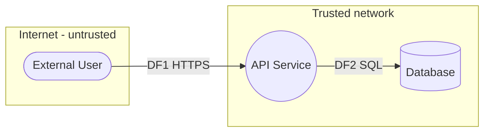

# Threat Model: <SYSTEM / FEATURE NAME>

| Field | Value |
|---|---|
| Author | <name> |
| Date | <YYYY-MM-DD> |
| Version | <0.1> |
| Status | Draft / In review / Approved |
| Reviewers | <names> |

## 1. Scope and context

**Purpose:** <what the system does in 1-2 sentences>

**In scope:** <components, flows, environments covered>

**Out of scope:** <explicitly excluded; e.g., underlying cloud provider, corporate IdP>

**Assumptions:** <trusted infrastructure, existing controls relied upon>

### Assets (what attackers want)
| Asset | Sensitivity | Why it matters |
|---|---|---|
| <e.g., user PII> | High | <regulatory, reputational> |
| <e.g., service availability> | High | <revenue> |

### Existing controls
- <e.g., TLS everywhere, OIDC auth, WAF, RBAC>

## 2. Data flow diagram

### Element inventory
| ID | Type | Name | Trust level | Notes |
|---|---|---|---|---|
| E1 | External entity | <user> | Untrusted | |
| P1 | Process | <api service> | Trusted | |
| DS1 | Data store | <database> | Trusted | |
| DF1 | Data flow | <https request> | crosses Internet boundary | |
| DF2 | Data flow | <sql query> | internal | |

### Trust boundaries
- TB1: Internet edge between E1 and P1.
- TB2: <e.g., app/database, tenant separation, privilege change>

## 3. Threats (STRIDE per element)

> Specialize each threat to this system. ID, category, target element, agent, action, impact.

| ID | STRIDE | Element | Threat (agent -> action -> impact) | Likelihood (1-5) | Impact (1-5) | Score | Risk |
|---|---|---|---|:-:|:-:|:-:|---|
| T-01 | S | DF1/P1 | <...> | 4 | 4 | 16 | High |
| T-02 | T | DF2 | <...> | 3 | 5 | 15 | High |
| T-03 | D | P1 | <...> | 4 | 3 | 12 | Medium |
| T-04 | I | DS1 | <...> | | | | |
| T-05 | R | DS1 | <...> | | | | |
| T-06 | E | P1 | <...> | | | | |

## 4. Mitigations

| Threat ID | Response | Control / countermeasure | Owner | Status | Residual risk |
|---|---|---|---|---|---|
| T-01 | Mitigate | <HMAC signature + anti-replay> | <owner> | Implemented | Low |
| T-02 | Mitigate | <parameterized queries + input validation> | <owner> | Planned | Low |
| T-03 | Mitigate | <rate limiting + queue + pool cap> | <owner> | Proposed | Medium |

Response legend: Mitigate / Eliminate / Transfer / Accept.

## 5. Validation ("did we do a good enough job?")

- [ ] Every DFD element has at least one threat considered (or a recorded reason it has none).
- [ ] Every trust boundary enforces authentication and authorization.
- [ ] All Critical/High threats have an owned mitigation with a status.
- [ ] Sensitive data is encrypted in transit and at rest.
- [ ] Security-relevant events are logged to a tamper-evident store.
- [ ] Assumptions and out-of-scope items are documented.
- [ ] A verification plan exists (security tests / pen test scope) for high-risk areas.

## 6. Open questions / follow-ups
- <...>
